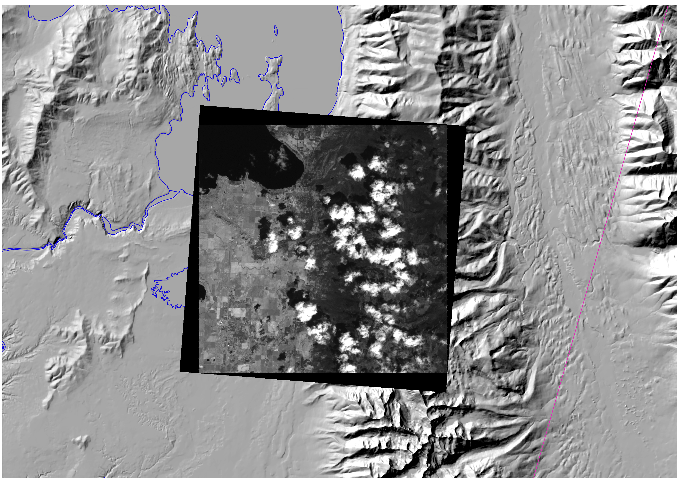

# 

[](https://travis-ci.org/dgketchum/satellite_image)
[](https://codecov.io/gh/dgketchum/satellite_image)

# satellite_image
Provides a class to process images from various satellites, return: geographic information, 
cloud mask, reflectance, brightness temperature.

At this point, Landsat 5, 7, 8 (i.e., TM, ETM+, OLI, TIRS; a.k.a. LT5, LE7, LC8) are supported.  
Use [Landsat 578](https://github.com/dgketchum/Landsat578) to download and unzip an image based on 
the date and the location, pass the directory containing the unzipped package of files,
and get an object that full attributes, a bounding feature, and methods to return ndarrays 
 with all the information we want from Landsat:

- Fmask cloudmask, water mask, shadow mask, or combination mask.
- NDVI, NDSI; Normalized difference vegetation density, snow density.
- At-satellite brightness temperature for thermal bands.
- Reflectance for optical bands.
- Albedo using the method from Smith, currently working on Tasumi.
- Save any of these arrays as a GeoTiff.

Installation:

```
pip install SatelliteImage
```

Given this small section of a Landsat 7 image of the S. Flathead Lake and the 
Mission Mountians in Montana, ETM+ band 5:

# 

```
import os

from sat_image.image import Landsat7
from sat_image.fmask import Fmask


def fmask(image_dir, outdir):
    l7 = Landsat7(image_dir)

    f = Fmask(l7)
    cloud, shadow, water = f.cloud_mask()
    combo = f.cloud_mask(combined=True)

    f.save_array(cloud, os.path.join(outdir, 'cloud_mask_l7.tif'))
    f.save_array(shadow, os.path.join(outdir, 'shadow_mask_l7.tif'))
    f.save_array(water, os.path.join(outdir, 'water_mask_l7.tif'))
    f.save_array(combo, os.path.join(outdir, 'combo_mask_l7.tif'))

    return None


if __name__ == '__main__':
    image_directory = os.path.join('data', 'images', 'LE70410272007125EDC00')
    out_directory = os.path.join('data', 'masks')
    fmask(image_directory, out_directory)
    
```

Gives the cloud mask:


the shadow mask:


the water mask:


or a combination of all masks, leaving `0` everywhere there is clear sky:


```
import os
import datetime

from sat_image.image import Landsat7


def ndvi(image_dir, outdir):
    l7 = Landsat7(image_dir)

    ndvi = l7.ndvi()
    date = l7.date_acquired
    date_str = datetime.datetime.strftime(date, '%Y%m%d')
    ndvi.save_array(ndvi, os.path.join(outdir, 'ndvi_l7_{}.tif'.format(date_str)))

    return None


if __name__ == '__main__':
    out_directory = os.path.join('data', 'ndvi')
    image_directory = os.path.join('data', 'images', 'LE70410272007125EDC00')
    fmask(image_directory, out_directory)
    
```

Gives NDVI, or Normalized Density Vegetation Index:


and so on...

We're currently working on atmospheric corrections based on Tasumi (2008). Please
contribute and make a pull request!
